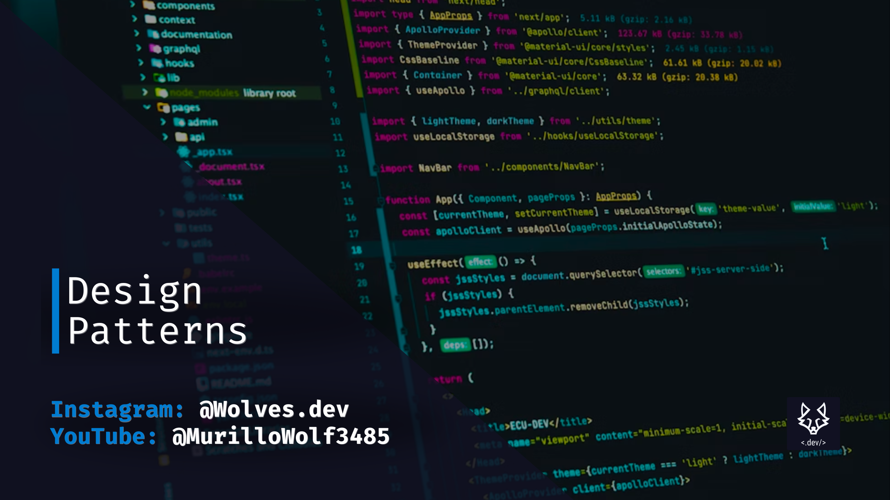

# Design Patterns in TS

Repositorio com exemplos de design patterns em TypeScript.
Playlist no Youtube:

Para rodar os exemplos, basta clonar o repositório e rodar o comando `npm install` para instalar as dependências e `npm start` para rodar o projeto.



## Description

### Singleton

```bash
npm run singleton
```

### Observer

```bash
# Exemplo 1 - Sem estado
npm run observer-1

# Exemplo 2 (Product) - Com estado
npm run observer-2
```
